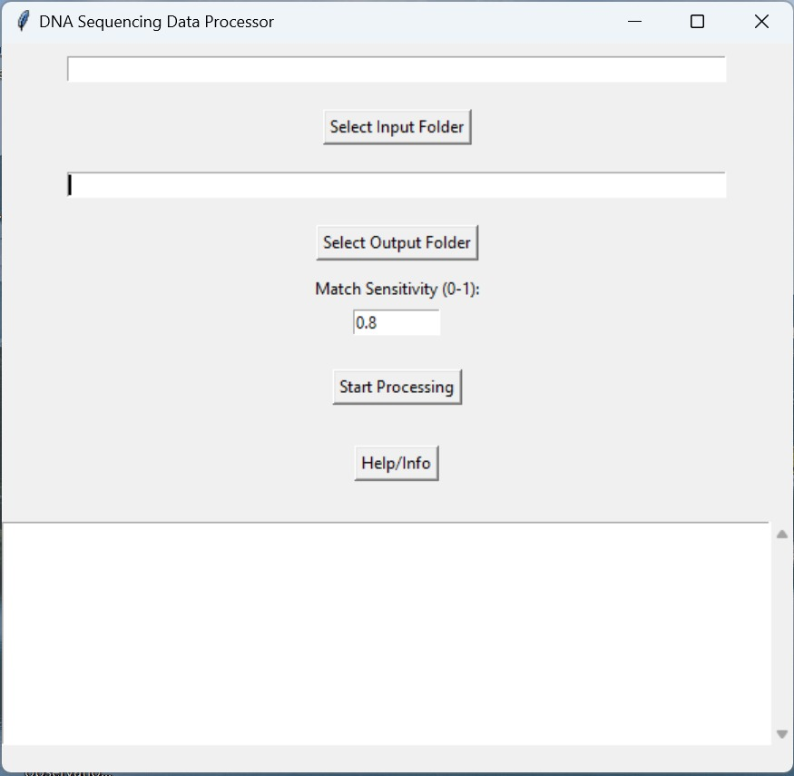

# DNA Sequencing Data Processor

## Overview

This tool synchronizes DNA sequencing results from multiple platforms including the ABI 3500 Genetic Analyzer, ANDE, and RapidHIT systems, facilitating the analysis and comparison of genetic data.

## Installation

### Python setup

Ensure Python is installed on your system:
1. Open a Command Prompt window.
2. Type `python --version`. If Python is installed, it will display the version number. If not, it will show an error message.
3. For Python installation, please follow the steps in the `Python Installation guide.docx` file.

### Setup

1. Run the `DNA analyzer installer.bat` file to install the application. This will also install the necessary requirements, and the application will start upon completion.
2. A clickable application shortcut is created for future usage. Place it where you please for later use. Note that the application shortcut is linked to the location of `DNA analyzer installer.bat`; if the folder is moved, the shortcut will not work.

## Application Usage

### Input Folder
- The program is designed to process folders within a larger folder by looking for the relevant files for analysis. If this method proves ineffective, consider directly placing the XML and TXT result files you wish to analyze into the input folder.
- The application supports XML files in CODIS and NIEM formats, and TXT files containing allele data.
- Ensure that only files in the format of the machine output are placed in the input folder.

### Output Folder
- Choose an output folder where the results will be saved. If not specified, the results will be saved in the same directory as the input folder.

## User Interface

  <!-- Replace 'image.png' with the actual path of the image file in your project directory -->

## Additional Resources

For more detailed information, open the `DNA Analyzer User Manual.docx`.
